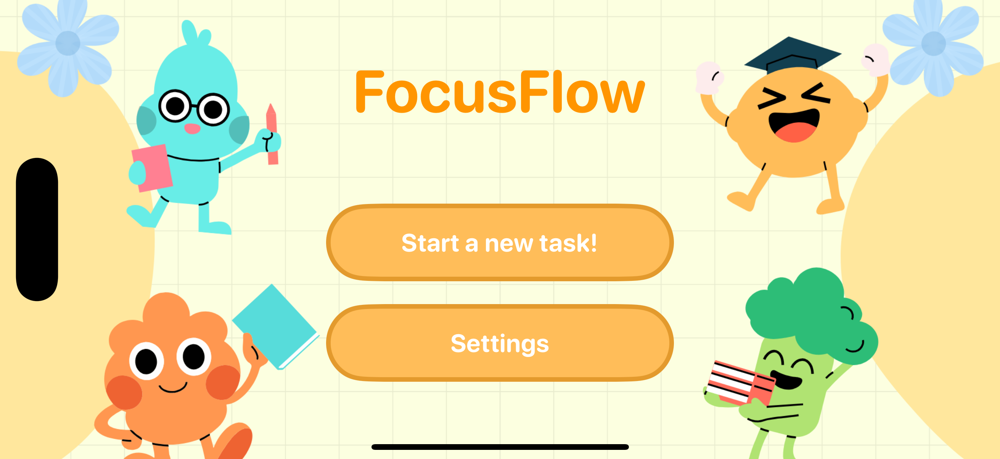
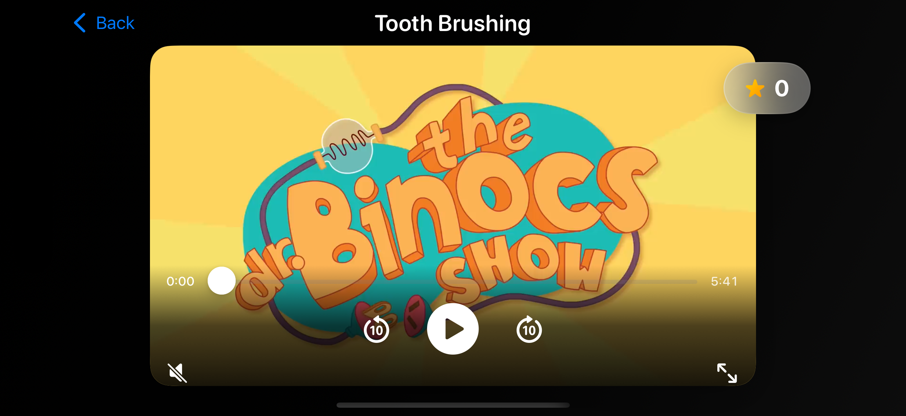
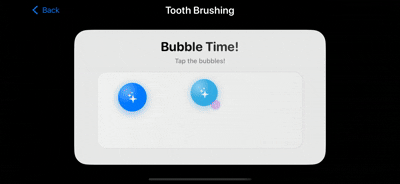
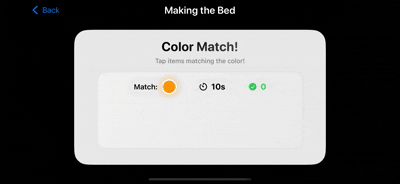
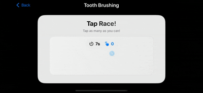
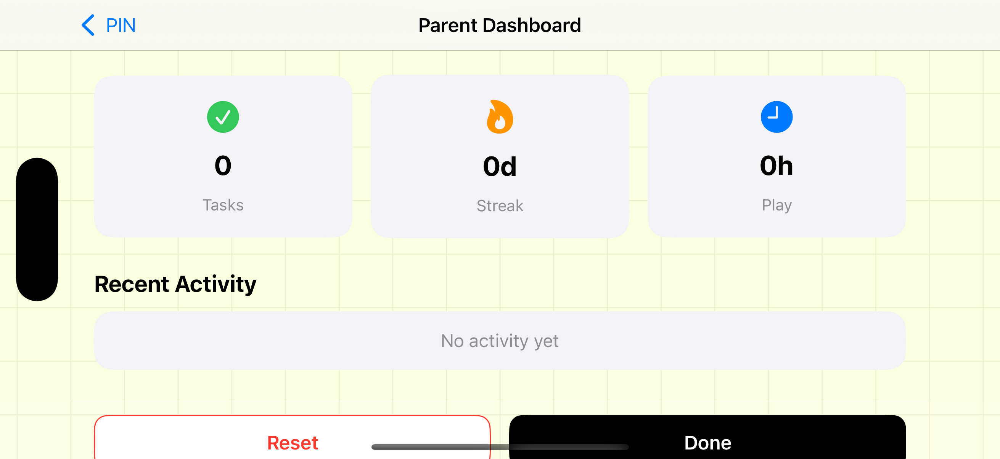

# FocusFlow
An interactive learning application designed to help children stay focused while watching educational videos through engaging mini-games.



## Overview
FocusFlow combines video learning with interactive games to maintain children's attention and engagement. As students watch educational content, they can participate in fun mini-games that encourage active learning and sustained focus.

## Features

### 📺 Video Learning
- Watch educational videos with an intuitive, child-friendly interface
- Seamless video playback experience

### 🎮 Interactive Mini-Games
FocusFlow includes three engaging games that appear while videos play to keep children actively engaged:

1. **Pop All Bubble** - Tap bubbles to pop them and maintain focus
2. **Color Match** - Match colors to reinforce attention and cognitive skills
3. **Tap Race** - Quick-tap challenges to keep energy high

### 👨‍👩‍👧 Parental Dashboard
- Monitor your child's learning progress
- Track engagement metrics and activity
- Manage content and settings

## Screenshots



*Watch educational videos with interactive elements*

### Three fun games to maintain focus:

**Pop All Bubble**



**Color Match**



**Tap Race**





*Monitor progress and manage settings from the parental dashboard*

## Installation
```bash
# Clone the repository
git clone https://github.com/TazkieCT/FocusFlow.git
```
Open the project file in your XCode and run in your simulator.

## Usage

### For Children
1. Select an educational video to watch
2. Play the mini-games that appear during the video
3. Stay engaged and learn while having fun!

### For Parents
1. Access the Parental Dashboard
2. View your child's learning statistics

### Notion (For more information)
[Our notion!](https://www.notion.so/FOCUS-FLOW-Attention-Training-Apps-2ca49801db80801f8c7acc2bdcb08a2a)

### Video Credits
Videos sourced from:
- [Tooth Brushing - PeekaBoo Kidz](https://www.youtube.com/watch?v=XbxsdbisXzU)
- [Make the Bed - Hidden Pigeon Channel](https://www.youtube.com/watch?v=QBzynorzi_Q)
